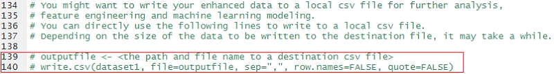

The R scripts in this directory process the raw sensory data collected from the sport sensors when athletes complete certain tasks, and extract features from the raw sensory data to characterize the position, movement, and coordination of different body parts. You are recommended to run the R scripts sequentially, since the output from one step will be used in the next step. 

For a more complete end to end pipeline, including the following 3 steps, and further steps of variable selection and machine learning modeling, please take a look at the [Azure ML experiment](https://aka.ms/sports-sensor-aml-exp) we published at Cortana Intelligence Gallery. We also provide an accompanied [Jupyter Notebook](./Sport_Sensor_Data_Analysis_and_Modeling.ipynb) _Sport\_Sensor\_Data\_Analysis\_and\_Modeling.ipynb_ which allows you to interactively explore the features generated after Step 3 (described later), understand deeper on how the professional and amateur skiers differ on some critical body parts coordination and gestures, etc. This Jupyter Notebook also trains a logistic regression model (with _L1_ regularization) on the selected most important variables, which helps you to further understand the importance of variables and their impacts on differentiating the skill levels.

## Step 1. Transform Data from Long to Wide
Usually, the sensory data is saved in a "long" way, meaning that at each sampling point, the reading of a single sensor is saved as a row in the dataset. If each sensor is measuring 10 variables, each row will have 10 columns for these 10 variables. If we have 5 sensors which are sampling at the same time stamp, we will have 5 rows like this at each sampling time stamp. Such a "long" format of sensory data can be depicted in the following image.

Such kind of data storage format makes data recording easy, but presents some challenge for data analysis and modeling. For data analysis and modeling, we prefer that at each time stamp, for each experimental subject, there is only one record, and each column represents a variable measured by a sensor. In the previous example, if each sensor is measuring 10 variables, and we have 5 sensors, data analysis and modeling prefer to have 1 row with 50 columns for each sampling time stamp. We call this format of data as "Wide".  

The script _Step1\_Transform\_Long\_to\_Wide.R_ transforms the data from long to wide format. In the long data format, the first few columns _ExperimentDate_, _ExperimentTime_, _ExperimentTimeFraction_, _experimentid_, _activityTypeId_, and _subjectId_ are needed to uniquely identify the time stamp of the sensor reading. The _tag_ column is needed to concatenate with the original column names _x_, _y_, etc to generate new columns names after transformation so the new column names will be _Head x_, _Head y_, _LeftFoot x_, _LeftFoot y_, etc. These fields will be used in _Step1\_Transform\_Long\_to\_Wide.R_ script (lines 58 - 62) so the script knows how to align readings of all sensors (align on the same value of ID columns), and how to name the columns after transformation. 

After transformation, the data in "Wide" format will look like this:

Before you run this script, open the R script file in a R IDE like RStudio, go to line 70, and add the path and name to a csv file that you want to use to save the "Wide" data after transformation. This wide data will be used in the next step to derive more columns from the raw sensory signals. 

[NOTE] Since the raw sensory data in this study is of the size ~1.4GB, this script might take hours to complete. From line 32, you can see that the script is reading the data from a [URL](https://aka.ms/sportssensordata) where we share the raw long sensory data. Downloading the data from this URL to your local machine first, and loading the data into your R workspace from the local copy might help speed up the transformation process. 

## Step 2. Derive Extra Columns to Characterize Movements and Gestures from Raw Sensory Data
The original sensory data records the position, speed, acceleration, and torque of each body part that the sensor is attached to. However, for sports analysis, the relationship between multiple body parts, and how they coordinate to complete a certain task, can be more powerful in characterizing the movements and gestures of an athlete. For this reason, in step 2, for each sampling time stamp, we generate more columns from the raw sensor readings by running script _Step2\_Enhance\_Sensor\_Data.R_. 

This R script file takes two inputs. In line 24, you need to provide the path to the wide sensory data after transformation in Step 1. In line 28, you need to provide a configuration file (in csv format) to specify what extra columns you want to generate from the raw sensory data, and which are the source columns needed to generate each extra column. If you want to try it on the data we shared in this study, you can directly use the _Step2\_Config\_DerivedSensors.csv_ as the configuration file for this R script, depicted as follows:

Currently, functions of calculating four types of extra columns have been defined in the R script file, including _Distance_ between two points (1-D, 2-D, or 3-D), center point between two points in one single coordinate, normal line to a plane spanned by three points in 3-D space, and the cosine of an angle between two vectors in 3-D space. If a point is defined in 2-D or 3-D space, the coordinates of each point should be separated by symbol ":", as seen in the picture above in columns _Input\_ColName1_, _Input\_ColName2_, and _Input\_ColName3_. 

If you would like to generate column types of columns, you can modify the configuration file, and add the functions to calculate these types of columns in the R script. 

After this R script completes running, the extra columns, with names defined in column _Output\_ColName_ in the configuration file, will be added to the end of the wide dataset. 

You can save the wide data with the extra columns to a local csv file. Go to lines 139 and 140 of _Step2\_Enhance\_Sensor\_Data.R_, remote the comments, and provide the name and path to a local csv file. The following feature engineering script will work on this local csv file. 

## Step 3. Generate Features from Each Column of the Enhanced Sensory Data
In this study, we totally collected data in 34 exercises from 3 subjects, where we had 2 professional and 1 amateur skiers. Every athlete took about 20-40 seconds to complete a task. We decided to slice the interval of each task into 2-second time windows, so that we have the opportunity to investigate the movements and gestures of athletes in a finer time granularity than only investigating the entire exercise. 

In each of the 2-second time windows, we extract descriptive statistics in both time and frequency domains from each column we have after Step 2 as described above, and correlations between two columns to characterize how two body parts coordinated during the exercise. There is a configuration file, _Step3\_Config\_Feature\_Dict.csv_, that defines how the data of each exercise should be sliced, which columns we should extract features from, and what are the correlations we should extract, etc. You should provide the path and name to this configuration file, as well as the path and file name to the _Wide_ sensory data (output from Step 2, or from Step 1 without adding extra columns) in lines 17 and 22 in _Step3\_SensorData\_Feature\_Engineering.R_, as shown below. 

 

The format of the configuration file _Step3\_Config\_Feature\_Dict.csv_ is as follows. It is actually a JSON-formatted text file. We named it with file extension _.csv_ only to make the same configuration file applicable in both Azure ML experiment (link provided at the top of this document) and the R script file. 

Here are more detailed description of the fields in the configuration file:

- Sampling_Frequency: the sampling frequency of the sports sensors. This filed is needed in the Fast Fourier Transformation (FFT). We transform the sensory signals in each time window into frequency domain, and the average magnitudes of half of the sampling frequency are used to calculate the power in  low (1-40 Hz), medium (41-80 Hz), and high (81-120 Hz) frequency bands. 

- Window Size: number of points included in each time window. 480 points are exactly 2 seconds (with sampling frequency 240 Hz).

- Id_Columns: the list of columns that you want to keep in the output feature set, a string separated by ",". Keeping these columns in the output feature set might allow you to identify the time stamp that each row of the output feature set is referring to. 

- Segmented_By: the list of columns that uniquely defines an exercise. For each unique combination of the list of columns, you are slicing the observations into windows. A string type variable where column names are separated by ",".

- Sensor_Columns: list of columns that you want to extract features from. Accepted formats include indexes (starting from 1) of columns separated by "," (e.g., 1,2,3), a range of indexes like 1-10, or the combination of both like 1,2,4-10. 

- Correlations: Another JSON-formatted string with the format "<correlation name>:{"var1":"<var1 name\>", "var2":"<var2 name\>"}. 

Then, for each of the "Sensor_Columns" as specified in the configuration file, the following 10 features are extracted:

- 6 Descriptive statistics (median, standard deviation, maximum, minimum, 1st quantile, 3rd quantile)

- 4 magnitudes in frequency domain after FFT (constant power (power at frequency 0), low band (1-40 Hz), medium band (41-80 Hz), and high band (81-120 Hz). 

After the features for each of the sensory columns are calculated, the correlations between sensory columns are calculated and attached to the end of the feature set.

At the end of the R script file, add the path and name to a local CSV file where you want to save the feature set to. The feature set can be used for further analysis and machine learning modeling, as shown in the shared [Jupyter Notebook](./Sport_Sensor_Data_Analysis_and_Modeling.ipynb) _Sport\_Sensor\_Data\_Analysis\_and\_Modeling.ipynb_.  

