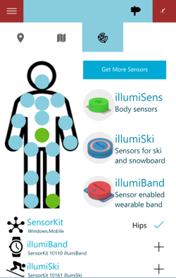
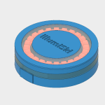
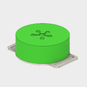
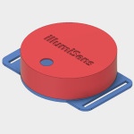

# SensorKit

SensorKit is an open library and a set of tools for sensors and machine learning. If you are a sensor manufacturer, the library provides a high level SDK to make it easier for developers to use your products. For developers, the library makes it very easy to connect Bluetooth LE sensors (or other sensors, e.g. WiFi etc) to you app, gather sensor data and process it with advanced machine learning and AI algorithms.



## How to add your sensor to SensorKit

* Add your own sensor to [SensorsRegistry](./SensorsRegistry.cs). SensorKit is open to all sensor manufacturers.

* Make sure to provide [SensorCapabilities](./SensorCapabilities.cs) describing what your sensor can do in the [SensorsRegistry](./SensorsRegistry.cs). If your sensor can do more than that, add new capability to [SensorCapabilities](./SensorCapabilities.cs)

* Clone and create a new connector class based on [SensorConnector](./SensorKitConnector.cs) class for your sensor (naming convention is ...Connector e.g. MySensorConnector.cs). This class describes how your sensor connects with your device.

* DONE! SensorKit automatically polls/accepts notifications from your sensor and updates its data model.

## How to use SensorKit in your app

A good place for SensorKit is your Universal app's App.xaml.cs file.

```C#
public SensorKit Sensors { get; set;}
```

Then instantiate SensorKit in your OnLaunched event. 

```C#
// make an instance of SensorKit
Sensors = new SensorKit();
```

Then, when your app needs to scan for sensors supported by SensorKit, add:

```C#
Sensors.StartScanning();
```
If you have SensorKit supported devices around, this will eventually add discovered devices to SensorKit.Data, a collection of discovered sensors. After sensors are added you can subscribe to them:

```C#
 var sensor = Sensors.FirstOrDefault(s=>s.Name == "My Sensor");
 if(sensor != null)
  await sensor.Subscribe();
 ``` 

The above subscribes to the sensor. You probably also need to tag your sensor (for example by establishing a human body joint it's attached to). Simply, set sensor.Tag, for example sensor.Tag = "LeftLowerArm"; Once the sensor is subscribed to, SensorKit will be polling data automatically, if you started polling with:

```C#
Sensors.Start();
``` 


SensorKit supports the latest Bluetooth stack, GATT Services and unpaired devices (you don't need to make users pair with the sensor for sensor kit to use its data).

## Azure Auto Upload

Uploading to Azure happens automatically, if you provided Azure storage account name, key and container. 

## Sensors supported by SensorKit

Add your own sensor to [SensorsRegistry](./SensorsRegistry.cs). SensorKit is open to all sensor manufacturers. If you are a registered developer, simply update GitHub with your sensor information in the open [SensorsRegistry](./SensorsRegistry.cs) and you can use SensorKit to connect to any sensors supported by the kit easily:

[](https://illumisens.com) [illumiSki](https://illumisens.com) sensor addon for ski and snowboard


[illumiSens](https://illumisens.com) body sensor with straps


[illumiBand](https://illumisens.com/) wearable wrist sensor

## Apps using SensorKit

[Active Fitness](http://activefitness.co) - Active Fitness is a fitness tracking app and a social fitness network of 2 million users

[Winter Sports](http://winter-sports.co) - Winter Sports is an app geared towards ski and snowboard enthusiasts

